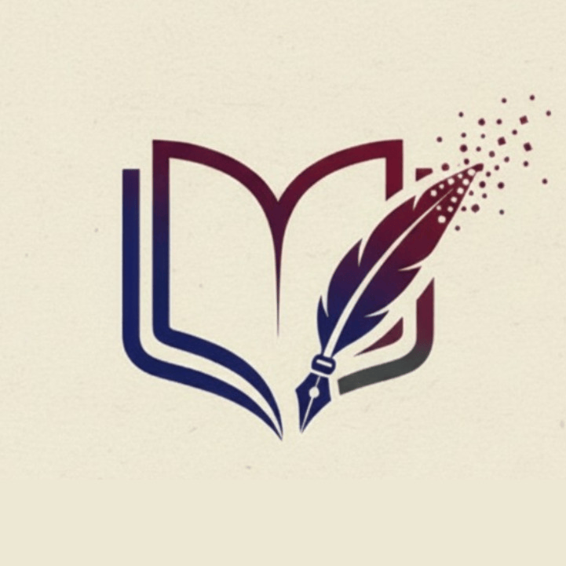

<div align="center">
  

  # ✒️ NovaScriptum Links

  ### Профессиональный академический консалтинг и помощь студентам

  [](https://github.com)
  [](https://github.com)
  [](https://github.com)

  <p align="center">
    <b>Эстетичный, полностью адаптированный сайт-визитка (мультиссылка) для агрегации контактов и быстрой связи с клиентами в один клик.</b>
  </p>
</div>

---

## 📖 О проекте

**NovaScriptum** — это современный консалтинговый проект, ориентированный на квалифицированную помощь студентам в написании и подготовке академических, исследовательских и аналитических работ любой сложности. 

Данный репозиторий содержит исходный код официальной посадочной страницы-визитки. Сайт разработан с акцентом на высокую скорость загрузки, премиальный визуальный стиль и интерактивный пользовательский опыт (UX). Деятельность сервиса полностью регламентирована внутренней публичной офертой об оказании информационно-консультационных услуг.

---

## 📞 Официальные контакты и каналы связи

Для оперативного взаимодействия, отправки технических заданий и координации текущих проектов используются исключительно авторизованные каналы Исполнителя:

* **💬 Менеджер Telegram (Заказы):** [@NovaScriptum_admin](https://t.me/NovaScriptum_admin) — *расчет стоимости, прием ТЗ и консультации*
* **📱 Чат WhatsApp:** [+7 (993) 307-93-73](https://wa.me/79933079373) — *быстрая клиентская поддержка*
* **📩 Наша почта:** [novascriptum@vk.com](mailto:novascriptum@vk.com) — *для официальных запросов*

### Наше медиа-пространство:
* **📢 Telegram-канал:** [NovaScriptum](https://t.me/NovaScriptum) — *основной ресурс проекта, публикации и отзывы*
* **👥 Сообщество ВКонтакте:** [vk.ru/novascriptum](https://vk.ru/novascriptum) — *полезные материалы, статьи и кейсы*
* **📸 Профиль Instagram:** [@novascriptum_admin](https://instagram.com/novascriptum_admin) — *официальный блог*

---

## ✨ Ключевые фичи и UI-эффекты

* **🌓 Адаптивная экосистема тем:** Полноценная поддержка **Ночной** (по умолчанию) и **Дневной** тем. Выбор пользователя бесшовно сохраняется в `localStorage` браузера.
* **🪶 Эффект «Пера» (Particle System):** Микро-анимация вылетающих частиц-перьев из логотипа при наведении или клике, изящно подчеркивающая тематику академического письма.
* **🌊 Интерактивные Ripple-волны:** При нажатии на любую кнопку-плашку от места клика расходится мягкая полупрозрачная волна (эффект Material Design).
* **🔮 Брендированное неоновое свечение:** Каждая кнопка при наведении плавно окрашивается в фирменный цвет соответствующей соцсети (Telegram, VK, Instagram, WhatsApp) с добавлением мягкого свечения.
* **⚖️ Юридическая прозрачность:** В подвал сайта интегрирована ссылка на официальные правила оказания информационно-консультационных услуг (публичную оферту) для повышения доверия аудитории.

---

## 🛠️ Стек технологий

Проект реализован на чистом стеке (**Vanilla**) без использования тяжеловесных фреймворков, что гарантирует максимальную производительность:

| Технология | Назначение в проекте |
| :--- | :--- |
| **HTML5** | Семантическая разметка, интеграция шрифтов *Geologica* & *Montserrat* и иконок *FontAwesome v6.4.0*. |
| **CSS3** | Продвинутая анимация (`@keyframes`), кастомные свойства (`:root`), размытие заднего плана (`backdrop-filter`) и темизация. |
| **Vanilla JS** | Логика переключения тем, обработка Web Animations API для генерации частиц и Ripple-эффекта. |

---

## 📂 Архитектура репозитория

```📁 novascriptum-links
├── 📄 index.html      # Главная страница и структура мультиссылки
├── 📄 style.css       # Кастомные стили, анимации и конфигурация тем (Light/Dark)
├── 📄 script.js       # Логика интерактивных эффектов, частиц и переключателя тем
├── 📄 oferta.txt      # Публичная оферта (правила оказания консультационных услуг)
├── 🖼️ logo.png        # Фирменный логотип проекта (круглый аватар)
└── 🖼️ favicon.png     # Иконка вкладки браузера (лого в миниатюре)
